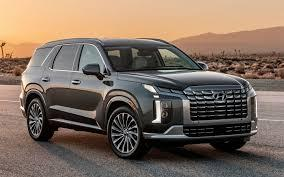

<html>
	<head>
	<title>MAG industries</title>
	<meta name="Glushnev Mikhail Alekseevich">
	<meta countent ="The site of the company MAG industries">
	<meta name="Keyboards" content="sait, MAG industries, interesting, tehnology, content, startup, 3d printer, arduino, code, knowledge, machine, auto, car, survey, be">	
	</head>
	
    <body style="background-color:#CCE1FE">
    
    
<b><a href="file:///Users/mihail/Desktop/MAG%20industries.html">вернуться на главную</a>&emsp;</b>

    
    

    
    
    <h2>
<b>future - right now</b>

				
(будующее - прямо сейчас)
</h2>
				
		
<h3>вопросы</h3>

		<form action="https://api.web3forms.com/submit" method="POST">
		<input type="hidden" name="access_key" value="cabd165b-582a-434a-8aec-d05523b4c7f7">
		
		
<input type="text" name="имя: " placeholder="Ваше Имя">
	 
	
	<input type="text" name="Сколько лет: " placeholder="Сколько вам лет" maxlength="3">
	
	
<input type="text" name="email: " placeholder="Ваш email">

	
	
	<!--начало первого вопроса-->
	
	<b>
1) Какие авто вы бы хотели что бы мы выпускали?
</b>
	
	&emsp;&emsp;&emsp;
	
	&emsp;&emsp;
	
	&emsp;&emsp;
	
	&emsp;&emsp;
	
	
	
	
			

		&emsp;Спорт. авто
		&emsp;&emsp;Авто золотого века 
		&emsp;Седаны, хетчбэки
	    &emsp;Кабриолеты	      		&emsp;&emsp;Внедорожники
			

			 
			&emsp;&emsp;&emsp;<input type="checkbox" name="1. спорт авто">
			 
			&emsp;&emsp;&emsp;&emsp;&emsp;&emsp;&emsp;&emsp;<input type="checkbox" name="1. люксовое авто золотого века">
			 
			&emsp;&emsp;&emsp;&emsp;&emsp;&emsp;&emsp;<input type="checkbox" name="1. седаны">
			 
			&emsp;&emsp;&emsp;&emsp;&emsp;&emsp;&emsp;<input type="checkbox" name="1. кабриолет">
			 
			&emsp;&emsp;&emsp;&emsp;&emsp;&emsp;&emsp;&emsp;<input type="checkbox" name="1. внедорожники">
			
			
		<!--конец первого вопроса-->
		
			
		<!--начало второго вопроса-->
			
<b>2) какой двигатель вы бы хотели там видеть?</b>

			

		 
&emsp;&emsp;&emsp;&emsp;
			 
			 &emsp;&emsp;&emsp;
			 
			 
			 
			 
&emsp; &emsp; ДВС
			<input type="checkbox" name="2. ДВС">
			&emsp;&emsp;&emsp;&emsp;&emsp;&emsp; Эл. двигатель 
			<input type="checkbox" name="2. Электро двигатель">
			&emsp;&emsp;&emsp;Гибрид. двигатель 
			<input type="checkbox" name="2. Гибридный двигатель">
		  <!--конец второго вопроса-->
		  
		  <!--начало третьего вопроса-->
			
<b>3) Какую цену за авто вы бы смогли себе позволить?</b>
			

			 До 10000$
			<input type="checkbox" name="3. до 10000$">

			 До 25000$
			<input type="checkbox" name="3. до 25000$">

			 Более 25000$
			<input type="checkbox" name="3. более 25000$">

		
		<!--конец третьего вопроса-->
		
		
		<!--начало четвертого вопроса-->
		
			<b>4) На каком авто вы бы хотели бы ездить?</b>
			

			 Отечественном
			<input type="checkbox" name="4. отечественной">

			 Зарубежном
			<input type="checkbox" name="4. зарубежной">

			
			<!--конец четвертого вопроса-->
		
		<!--начало пятого вопроса-->
			
			<b>5) Вы бы хотели что бы у наших машин была возможность управления выдвижения фар?</b>
			

			 Да
			<input type="checkbox" name="5. за выдвижные фары">

			 Нет
			<input type="checkbox" name="5. против выдвижных фар">

			
			<!--конец пятого вопроса-->
			
			<!--начало шестого вопроса-->
			
			<b>6) Какое кол-во передач на КПП вы хотели бы видеть?</b>

			
			<input type="textarea" name="6. кол-во скоростей на КПП" maxlength="2" placeholder="Число передач">

			
			<!--конец шестого вопроса-->
			
			<!--начало седьмого вопроса-->
			<b>7) Какое КПП вы хотели бы видеть в вашем авто?</b>

			
		 Механическая	<input type="checkbox" name="7. КПП. механика" >

			
	     Автомат <input type="checkbox" name="7. КПП. автомат" >

			
		 Робот <input type="checkbox" name="7. КПП. роботизированная" >

			
			<!--конец седьмого вопроса-->
			
		<!--начало восьмого вопроса-->	
			
			<b>8) За какое время до 100 км/ч был бы оптимален разгон на вашем авто?</b>
			

			<input type="textarea" name="8.время до 100 км/ч" maxlength="5" placeholder="время в секундах">

			<!--конец восьмого вопроса-->
			
			
<input type="submit" value="отправить" class="btn" name="send">
			
			<input type="reset" value="сброс">

				
				

				<small>
Все ваши ответы сторого конфиденсальны и не передаються третьим лицам.

